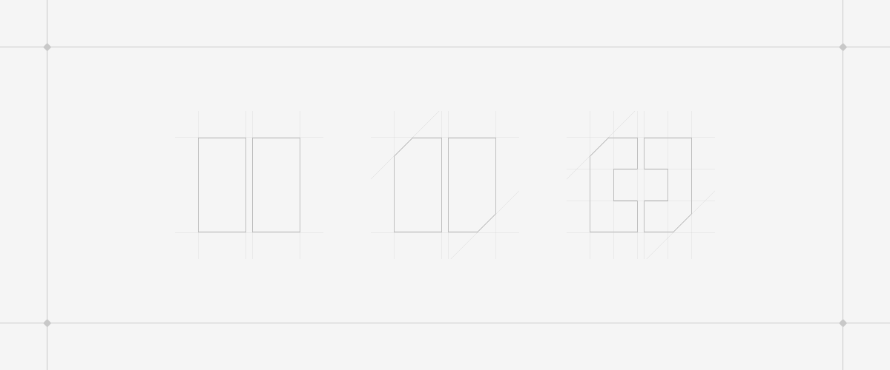

 

    <h1>eajuarezc-software-engineer 🐦‍🔥</h1>
    <table border="0" height="64">
        <tr>
        <td>
            
        </td>
        <td>
            
        </td>
        <td>
            
        </td>
        </tr>
    </table>

Me especializo en la arquitectura y desarrollo de productos escalables, donde la prioridad es entregar valor real al usuario. Aunque mi núcleo de desarrollo está basado en el ecosistema de **TypeScript y JavaScript**, opero bajo una mentalidad tecnológica agnóstica: evalúo, selecciono y me adapto a las herramientas que resuelvan de manera más eficiente los retos de cada negocio.

 

    <h3>Hablemos 📨</h3>
    <table border="0">
        <tr>
        <td>
            
        </td>
        <td>
            
        </td>
        <td>
            
        </td>
        </tr>
    </table>

